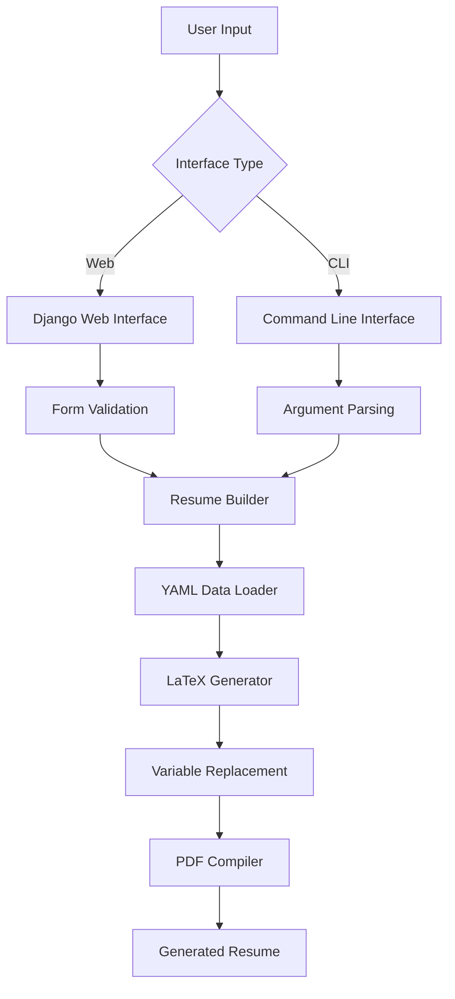
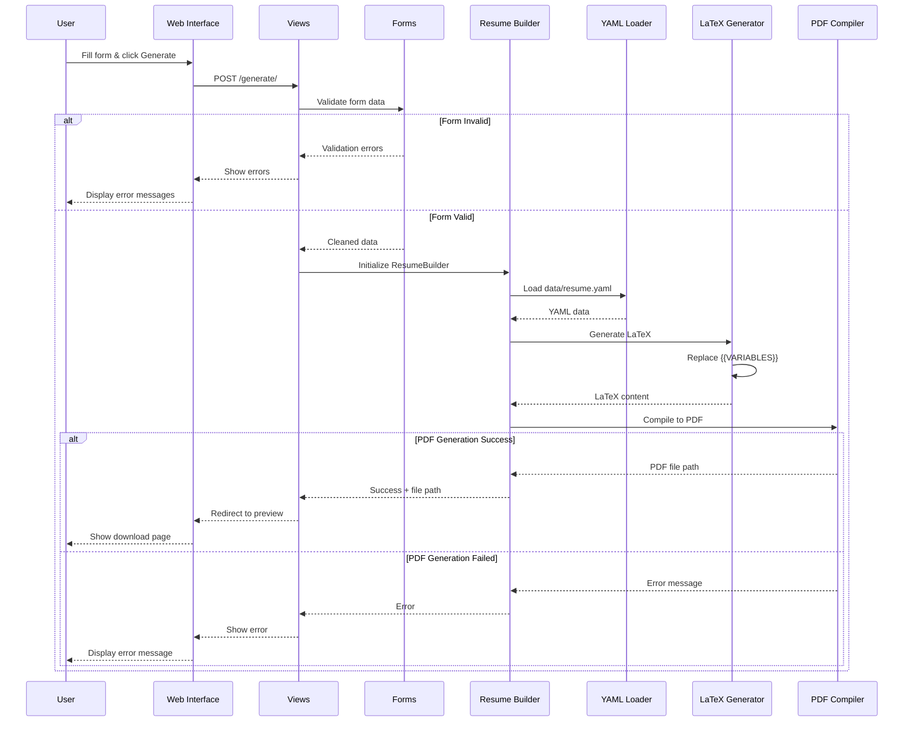

# Contributing to AI Resume Builder

Welcome to the AI Resume Builder project! We're excited to have you contribute to making resume generation more accessible and intelligent.

## 📊 Documentation

[](SYSTEM_FLOW.md)

For detailed technical diagrams and system architecture, see our [System Flow Documentation](SYSTEM_FLOW.md).

## 🚀 Project Overview

AI Resume Builder is a web application that generates professional resumes from YAML data using LaTeX templates. The system supports both web interface and CLI usage, with optional AI-powered customization for job-specific resume tailoring.

## 🎯 How to Contribute

### Quick Start for Contributors

1. **Fork the repository**
2. **Clone your fork**
   ```bash
   git clone https://github.com/your-username/resume-builder.git
   cd resume-builder
   ```

3. **Set up development environment**
   ```bash
   # Using Docker (Recommended)
   docker-compose up --build
   
   # Or local development
   pip install -r requirements.txt
   python manage.py runserver
   ```

4. **Make your changes**
5. **Test your changes**
6. **Submit a pull request**

## 🏗️ System Architecture

### High-Level Flow



### Detailed Web Interface Flow



## 📁 Project Structure

```
resume-builder/
├── ai/                     # AI customization (optional)
│   ├── ai_client.py       # OpenAI API client
│   └── customization_engine.py
├── app/                    # Core application logic
│   ├── config.py          # Configuration settings
│   └── resume_builder.py  # Main resume builder class
├── core/                   # Core functionality
│   ├── latex_generator.py # LaTeX generation with variable replacement
│   ├── pdf_compiler.py    # PDF compilation using LaTeX
│   └── yaml_processor.py  # YAML data processing
├── data/                   # Resume data
│   └── resume.yaml        # Main resume data file
├── models/                 # Data models
│   ├── job_profile.py
│   └── resume_data.py
├── templates/              # LaTeX templates
│   └── resume.tex         # Main resume template
├── web/                    # Django web interface
│   ├── resume_app/        # Main Django app
│   │   ├── forms.py       # Form definitions
│   │   ├── views.py       # Request handlers
│   │   └── urls.py        # URL routing
│   └── templates/         # HTML templates
└── cli.py                 # Command line interface
```

## 🔧 Key Components

### 1. Resume Data (YAML)
- **Location**: `data/resume.yaml`
- **Format**: Simple key-value pairs for variable replacement
- **Example**:
  ```yaml
  name: "John Doe"
  email: "john@example.com"
  phone: "+1-555-0123"
  # ... more fields
  ```

### 2. LaTeX Template
- **Location**: `templates/resume.tex`
- **Format**: LaTeX with `{{VARIABLE}}` placeholders
- **Processing**: Simple string replacement (no Jinja2)

### 3. Web Interface
- **Framework**: Django
- **Forms**: Simple two-field form (API key, job posting)
- **Views**: Single generate view that processes form and creates PDF
- **Templates**: Bootstrap-styled responsive interface

### 4. CLI Interface
- **File**: `cli.py`
- **Usage**: `python cli.py --job-post "job.txt" --output "resume.pdf"`
- **Features**: Batch processing, automation-friendly

## 🎨 Contributing Areas

### 🌟 High Priority Contributions

1. **Template Improvements**
   - New LaTeX resume templates
   - Better formatting and styling
   - Mobile-responsive PDF layouts

2. **Web Interface Enhancements**
   - Better error handling and user feedback
   - Progress indicators during PDF generation
   - Resume preview before download

3. **Core Functionality**
   - Support for multiple resume templates
   - Better YAML validation and error messages
   - Improved PDF generation performance

### 🔧 Medium Priority Contributions

1. **Developer Experience**
   - Better documentation and examples
   - Automated testing improvements
   - Docker optimization

2. **Features**
   - Resume version management
   - Export to additional formats (Word, HTML)
   - Resume analytics and optimization suggestions

### 💡 Low Priority / Nice to Have

1. **AI Integration**
   - Improved AI customization prompts
   - Support for other AI providers
   - Smart job requirement extraction

2. **Advanced Features**
   - Multi-language support
   - Resume scoring system
   - Integration with job boards

## 🧪 Testing Guidelines

### Running Tests
```bash
# Run all tests
python -m pytest tests/

# Run specific test categories
python test_ai_integration.py
python test_web_integration.py
```

### Test Coverage Areas
- **Form validation**: Ensure proper error handling
- **YAML processing**: Test data loading and validation
- **LaTeX generation**: Verify variable replacement
- **PDF compilation**: Test LaTeX to PDF conversion
- **Web interface**: End-to-end user flows

## 📝 Code Style Guidelines

### Python Code
- Follow PEP 8 style guidelines
- Use type hints where appropriate
- Write descriptive docstrings
- Keep functions focused and small

### Django Code
- Follow Django best practices
- Use proper form validation
- Handle errors gracefully
- Use Django messages framework for user feedback

### LaTeX Templates
- Keep templates clean and well-commented
- Use consistent formatting
- Test with various data inputs
- Ensure cross-platform compatibility

## 🐛 Bug Reports

When reporting bugs, please include:

1. **Environment details**
   - Operating system
   - Python version
   - Docker version (if using Docker)

2. **Steps to reproduce**
   - Exact steps taken
   - Input data used
   - Expected vs actual behavior

3. **Error messages**
   - Full error traceback
   - Log files if available
   - Screenshots for UI issues

## 💬 Feature Requests

For new features, please provide:

1. **Use case description**
   - Who would use this feature?
   - What problem does it solve?
   - How would it improve the user experience?

2. **Implementation suggestions**
   - Technical approach ideas
   - Potential challenges
   - Integration points

## 🔄 Development Workflow

### Branch Naming
- `feature/description` - New features
- `bugfix/description` - Bug fixes
- `docs/description` - Documentation updates
- `refactor/description` - Code refactoring

### Commit Messages
```
type(scope): description

Examples:
feat(web): add resume preview functionality
fix(latex): resolve variable replacement issue
docs(readme): update installation instructions
refactor(core): simplify PDF generation logic
```

### Pull Request Process

1. **Create feature branch** from `main`
2. **Make changes** with proper testing
3. **Update documentation** if needed
4. **Submit pull request** with:
   - Clear description of changes
   - Screenshots for UI changes
   - Test results
   - Breaking changes (if any)

## 🏆 Recognition

Contributors will be recognized in:
- README.md contributors section
- Release notes for significant contributions
- Project documentation

## 📞 Getting Help

- **GitHub Issues**: For bugs and feature requests
- **GitHub Discussions**: For questions and general discussion
- **Documentation**: Check README.md and code comments

## 📄 License

This project is licensed under the MIT License. By contributing, you agree that your contributions will be licensed under the same license.

---

Thank you for contributing to AI Resume Builder! Your efforts help make professional resume creation accessible to everyone. 🎉