# System Flow Documentation

This document provides detailed diagrams and explanations of how the AI Resume Builder system works.

## 🔄 Complete System Flow

### Overall Architecture

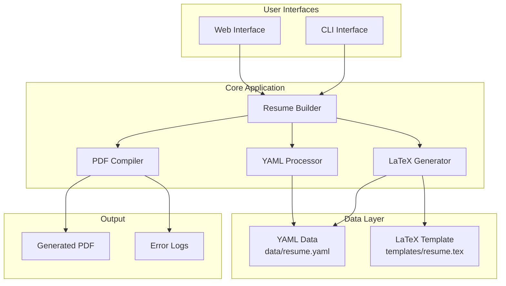

## 🌐 Web Interface Detailed Flow

### Form Submission Process

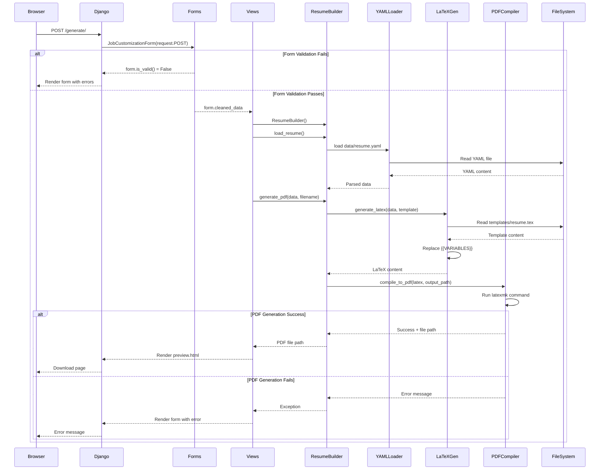

### Form Validation Details

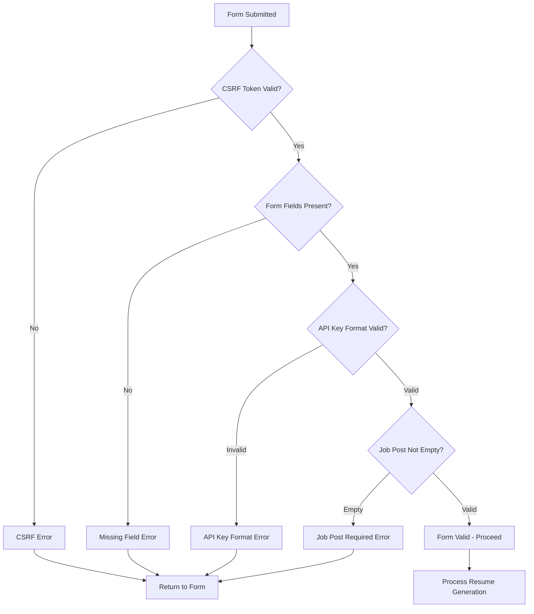

## 🖥️ CLI Interface Flow

### Command Processing

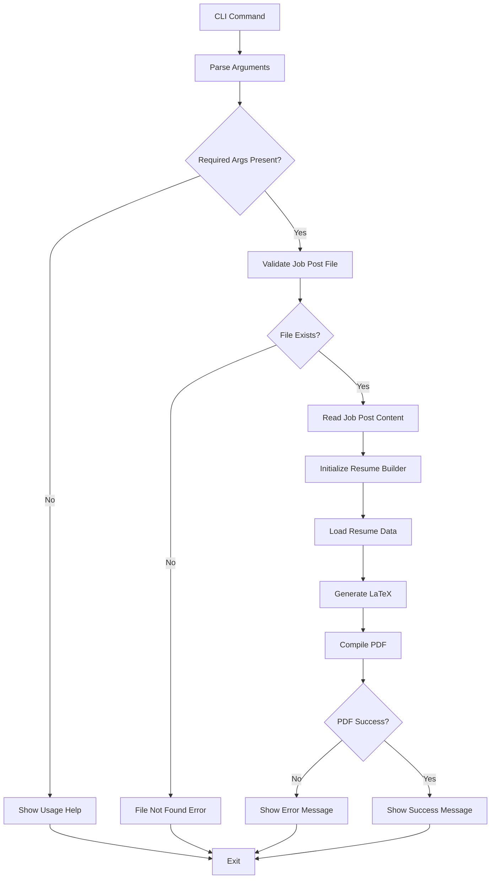

## 📄 Data Processing Flow

### YAML to PDF Transformation

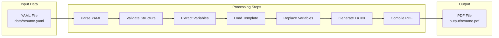

### Variable Replacement Process

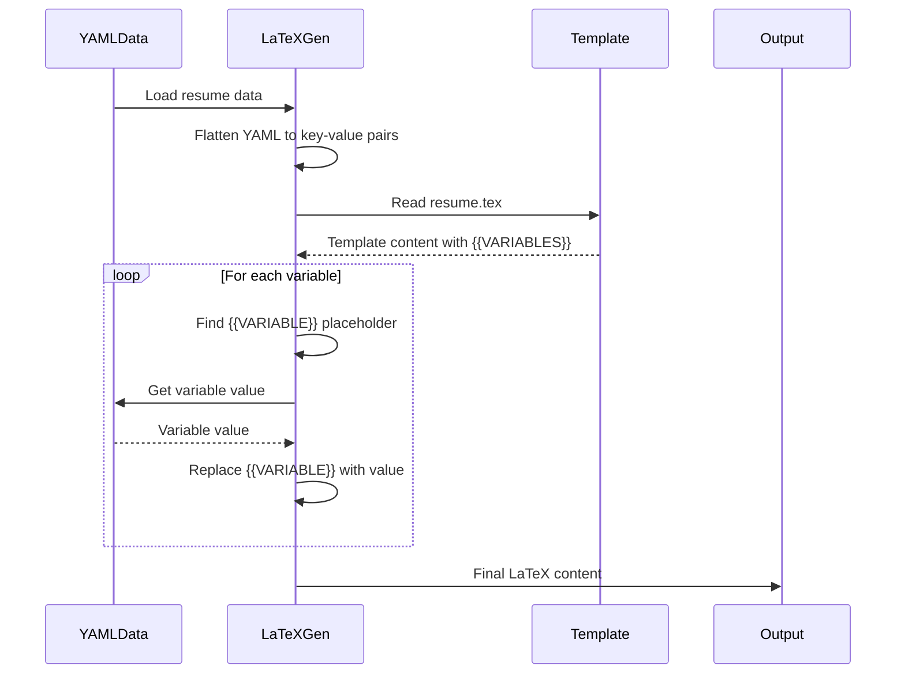

## 🔧 Error Handling Flow

### Error Types and Handling

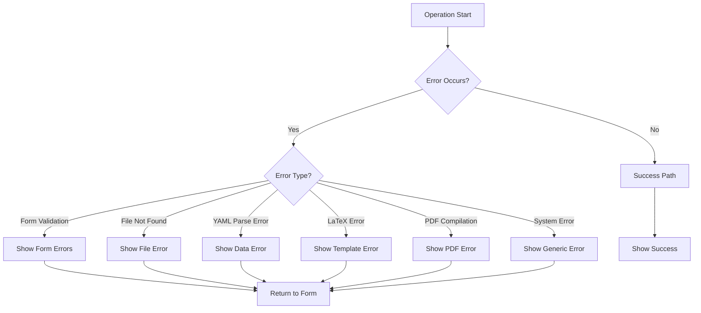

### Validation Chain

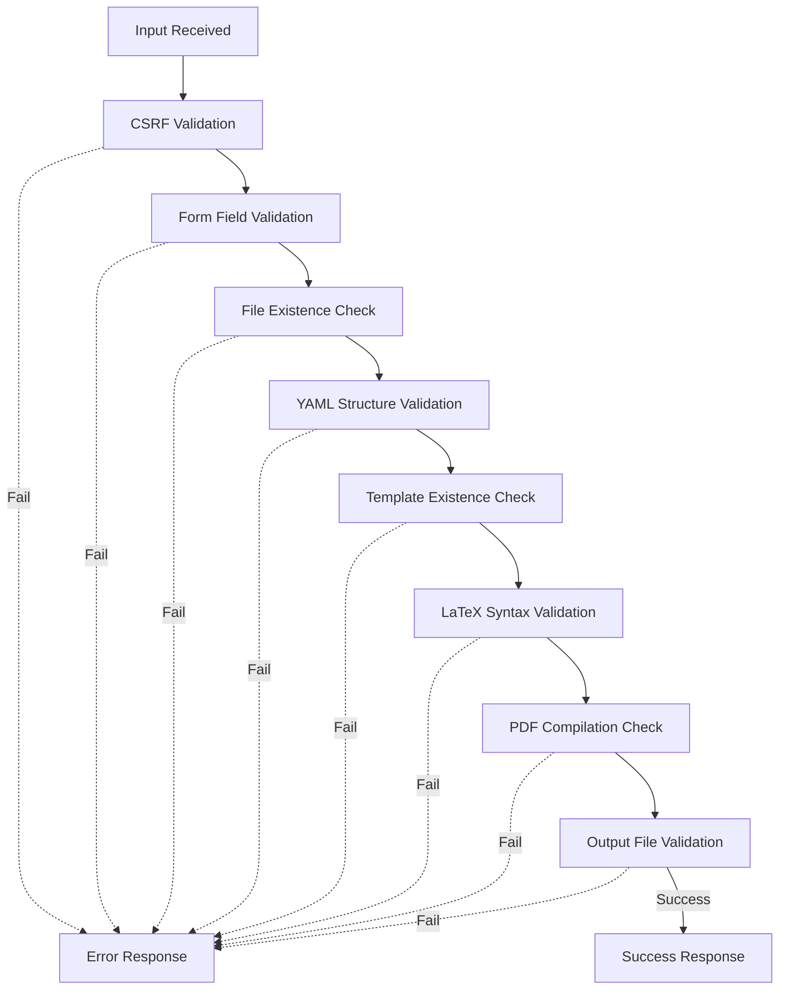

## 🏗️ Component Interaction

### Core Components Communication

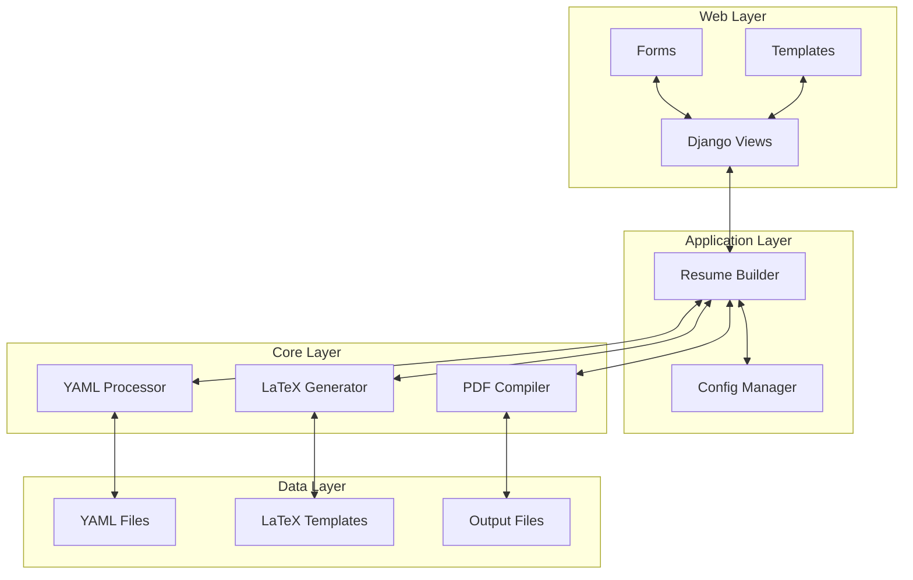

## 📊 Performance Flow

### Processing Time Breakdown

```mermaid
gantt
    title Resume Generation Timeline
    dateFormat X
    axisFormat %s
    
    section Form Processing
    Form Validation    :0, 100
    
    section Data Loading
    YAML Loading       :100, 200
    Template Loading   :150, 250
    
    section Generation
    Variable Replace   :250, 400
    LaTeX Generation   :400, 500
    
    section Compilation
    PDF Compilation    :500, 2000
    File Validation    :2000, 2100
    
    section Response
    Response Prep      :2100, 2200
```

## 🔄 State Management

### Application State Flow

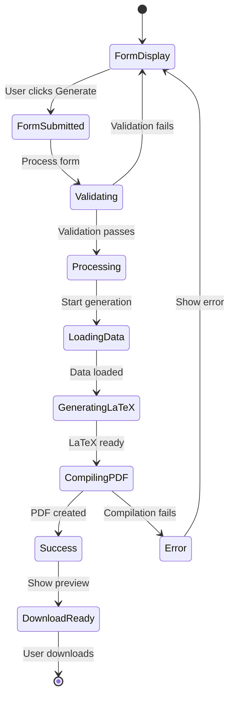

This documentation provides a comprehensive view of how the AI Resume Builder system processes requests, handles data, and generates PDFs. Each diagram shows different aspects of the system flow, from high-level architecture to detailed error handling.